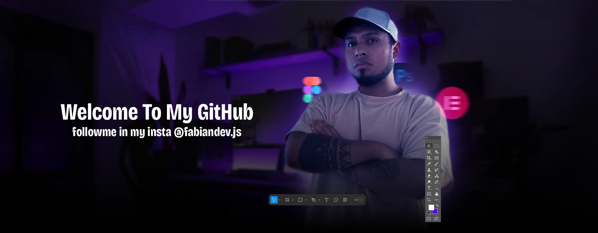

<h1>Hi! 🌟 I'm  Fabian Silva | Web Developer Full Stack 🚀 |</h1>

I’m a passionate web developer 👨‍💻 with experience in full-stack development 💡. My focus is on building web applications 🚀 that are efficient, scalable, and provide value to users. My goal is to deliver tech products that not only meet functional requirements ✅ but also enhance the user experience and optimize processes 🔧.

My stack includes technologies such as JavaScript 🖥️, React ⚛️, Node.js 🧑‍💻, and databases 🗄️, which allows me to work across both front-end and back-end on scalable and efficient projects. I’m always eager to stay up to date with the latest trends and apply best practices in agile development 📈.

🚀 What’s My Experience?

Web development (front-end and back-end) 🌍
UI/UX design and user experience 🎨
Process automation 🤖
Contributing to open-source projects 🌐
Exploring Artificial Intelligence 🤯
If you’re looking for a creative and dedicated collaborator, feel free to reach out! I’m always open to new projects, challenges, and learning opportunities 💬.

### 🛠 &nbsp;Tech Stack

&nbsp;
&nbsp;
&nbsp;
&nbsp;
&nbsp;
&nbsp;
&nbsp;
&nbsp;
&nbsp;
&nbsp;
&nbsp;
&nbsp;
&nbsp;

### 🗃 &nbsp;Databases

&nbsp;
&nbsp;

### 🧰 &nbsp;Version Controll & Tools 

&nbsp;
&nbsp;
&nbsp;
&nbsp;
&nbsp;
&nbsp;
&nbsp;
&nbsp;
